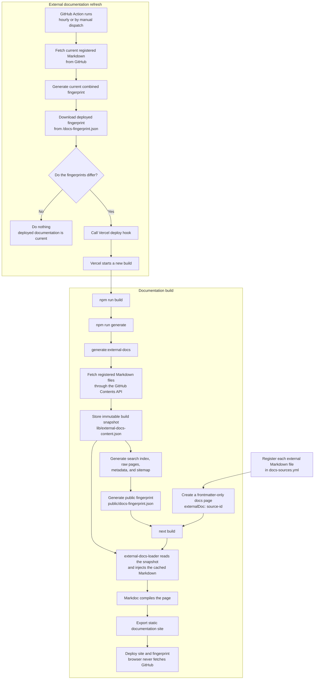

# Build-time external documentation

Use an external documentation page when one Markdown file in a service repository is the canonical source for a route on this site. External files are fetched before the static build; browsers never fetch the page Markdown.

## Workflow overview



## Register a source

Add the file to `docs-sources.yml`:

```yaml
sources:
  - id: epds-architecture
    title: ePDS
    repo: hypercerts-org/ePDS
    ref: main
    path: docs/architecture.md
```

- `id` is the stable lowercase identifier used by pages.
- `title` identifies the source in generated fingerprint metadata.
- `repo` is the GitHub `owner/repository` pair.
- `ref` is the branch, tag, or commit to fetch.
- `path` is one `.md`, `.mdoc`, or `.mdx` file in that repository.
- `trackRelease: true` optionally captures the repository's latest published stable GitHub Release alongside its changelog. A missing release is supported; failed requests and non-semantic or prerelease tags are not turned into version badges.

GitHub API request and browser URLs are derived internally. Do not add URLs, directory paths, or separate entrypoints to the registry.

## Create the page

Set `externalDoc` in a frontmatter-only page:

```md
---
title: ePDS (extended PDS)
description: How to integrate applications with ePDS login.
externalDoc: epds-architecture
---
```

Do not add a local Markdown body. The registered file is the only page body, which prevents stale fallback content from diverging from rendering, search, or `/raw` exports.

## Document a service with subpages

Use a local overview page for the service's role, status, supported environments, and relationship to the rest of the Hypercerts stack. Keep implementation-specific detail in the service repository when that repository owns the contract.

For each canonical upstream Markdown file:

1. Add a separate source entry to `docs-sources.yml`.
2. Add a frontmatter-only wrapper at the intended child route.
3. Link the imported child page from the local service overview.

This allows a service to have multiple source-backed subpages without copying its documentation into this repository. The current loader deliberately does not support a local introduction plus an imported body on the same route. Use a local parent page when editorial context is needed, then keep each imported child page fully canonical to its upstream file.

Choose `ref` according to the source's publishing policy. A moving branch such as `main` follows upstream changes through the refresh workflow. A tag or commit creates a stable documentation snapshot and must be updated deliberately.

## Build behavior

`npm run generate:external-docs` fetches every registered file once through the GitHub contents API and writes `lib/external-docs-content.json`. The static build then uses that immutable snapshot for:

- Markdoc page rendering;
- search indexing;
- local `/raw` page exports;
- last-updated metadata;
- deployed external-docs fingerprints.

External Markdown is parsed with the same Markdoc configuration as local pages. Relative links point to the source repository, relative images use public GitHub content URLs, and fenced `mermaid` diagrams render through the Mermaid component. Extensionless relative paths are treated as directories; link to extensionless files such as `LICENSE`, `Dockerfile`, or `Makefile` with an absolute GitHub URL.

## Protocol releases and component versions

`lib/protocol-releases.json` is the reviewed, canonical protocol major/minor history, newest first. The initial 1.0–1.4 entries are reconstructed from Lexicon releases; dates are the corresponding package publication dates. A component release does not automatically announce a new protocol release. Edit this file to publish the next coordinated release summary, compatibility guidance, and source version. An optional `blogUrl` adds a release-article link when an article is actually published.

`lib/release-components.json` names the seven participating components and their local changelog routes. A `sourceId` connects a component to a release-tracked source in `docs-sources.yml`. Components without a published release display **Under development**; the new SDK has no source repository attached yet. Entryway is separate from the preceding ePDS product, and HappyView's version is not substituted for the Hypercerts API version.

During generation, `lib/release-catalog.json` holds the compact version/status data used by the sidebar. The same catalog is saved inside the external content snapshot. Local pages use these standalone build-time markers:

- `release-latest`: short current-release summary for the landing page.
- `release-summary`: current release with highlights and source links.
- `release-cards`: protocol-history link and all component version/status cards.
- `protocol-history`: the full reviewed major/minor history.

Write a marker as a self-closing Markdoc-style line, such as ``. The shared page resolver expands it before Markdoc rendering, search indexing, or raw Markdown export, so those surfaces contain the same actual release information. No release lookup happens in the browser.

To connect a future component: register its verified `CHANGELOG.md` with `trackRelease: true`, assign that `sourceId` in the component registry, and replace the local status page with a frontmatter-only `externalDoc` wrapper. Do not point the new SDK or XRPC API at the similarly named legacy repositories.

A missing source, failed content request, empty file, local fallback body, or invalid Markdoc in an external page fails the build with an actionable error. The existing deployment remains online instead of publishing stale or inconsistent content. Source commit timestamps are informational and may be omitted when GitHub cannot provide them.

## Refresh workflow

`.github/workflows/docs-refresh.yml` runs hourly and can also be dispatched manually. It fetches the registered files and tracked release metadata, compares their combined fingerprint with the deployed site, and calls the configured Vercel deploy hook when they differ. A newly published component version triggers refresh even if the changelog content has not changed. Manual runs default to dry-run mode.

`.github/workflows/docs-ci.yml` runs tests and builds the static documentation on relevant pull requests targeting `main`; it does not call a deploy hook.

Configuration:

- `VERCEL_DEPLOY_HOOK_URL` is required before deployment is enabled.
- `DOCS_FINGERPRINT_URL` optionally selects the deployed fingerprint to compare.
- `DOCS_SOURCE_TOKEN` optionally grants source-repository access and additional GitHub API capacity. It is required for private repositories.
- `DOCS_ALLOWED_SOURCE_ORGS` optionally overrides the comma-separated trusted-owner allowlist. It defaults to `hypercerts-org,gainforest`.
