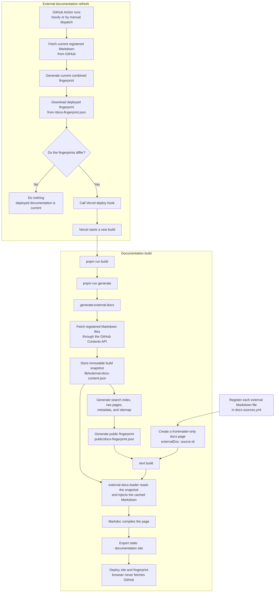

# Build-time changelog imports

Component changelogs are imported from their owning repositories at build time. They are the only imported content: all other pages, including component Reference pages, are written in this repository (see [Documentation ownership](information-architecture.md#documentation-ownership)). External files are fetched before the static build; browsers never fetch the page Markdown.

## Workflow overview


```mermaid
flowchart TD
    A["Register each external Markdown file<br/>in docs-sources.yml"]
    A --> B["Create a frontmatter-only docs page<br/>externalDoc: source-id"]

    subgraph Build["Documentation build"]
        C["pnpm run build"]
        C --> D["pnpm run generate"]
        D --> E["generate:external-docs"]
        E --> F["Fetch registered Markdown files<br/>through the GitHub Contents API"]
        F --> G["Store immutable build snapshot<br/>lib/external-docs-content.json"]
        G --> H["Generate search index, raw pages,<br/>metadata, and sitemap"]
        H --> I["Generate public fingerprint<br/>public/docs-fingerprint.json"]
        I --> J["next build"]

        B --> J
        G --> K["external-docs-loader reads the snapshot<br/>and injects the cached Markdown"]
        J --> K
        K --> L["Markdoc compiles the page"]
        L --> M["Export static documentation site"]
        M --> N["Deploy site and fingerprint<br/>browser never fetches GitHub"]
    end

    subgraph Refresh["External documentation refresh"]
        O["GitHub Action runs<br/>hourly or by manual dispatch"]
        O --> P["Fetch current registered Markdown<br/>from GitHub"]
        P --> Q["Generate current combined fingerprint"]
        Q --> R["Download deployed fingerprint<br/>from /docs-fingerprint.json"]
        R --> S{"Do the fingerprints differ?"}

        S -->|No| T["Do nothing<br/>deployed documentation is current"]
        S -->|Yes| U["Call Vercel deploy hook"]
        U --> V["Vercel starts a new build"]
    end

    V --> C
```

## Register a source

Add the file to `docs-sources.yml`:

```yaml
sources:
  - id: relay-changelog
    title: Hypercerts Relay changelog
    repo: hypercerts-org/hypercerts-relay
    ref: main
    path: CHANGELOG.md
    trackRelease: true
```

- `id` is the stable lowercase identifier used by pages.
- `title` identifies the source in generated fingerprint metadata.
- `repo` is the GitHub `owner/repository` pair.
- `ref` is the branch, tag, or commit to fetch.
- `path` is one `.md`, `.mdoc`, or `.mdx` file in that repository.
- `trackRelease: true` optionally captures the repository's latest published stable GitHub Release alongside its changelog. A missing release is supported; failed requests and non-semantic or prerelease tags are not turned into version badges.

GitHub API request and browser URLs are derived internally. Do not add URLs, directory paths, or separate entrypoints to the registry.

## Create the page

Set `externalDoc` in a frontmatter-only page:

```md
---
title: Hypercerts Relay Releases
description: Project-owned release history imported from the Hypercerts Relay repository.
externalDoc: relay-changelog
---
```

Do not add a local Markdown body. The registered file is the only page body, which prevents stale fallback content from diverging from rendering, search, or `/raw` exports.

Choose `ref` according to the source's publishing policy. A moving branch such as `main` follows upstream changes through the refresh workflow. A tag or commit creates a stable snapshot and must be updated deliberately.

## Build behavior

### Local development and GitHub rate limits

`pnpm run dev` reuses the last successful external-content snapshot when its sources still match `docs-sources.yml`. This makes repeated dev-server starts work offline and avoids spending GitHub API requests just to edit local pages. It still regenerates local release summaries, navigation data, search, and raw Markdown. The console reports the original fetch time; cached versions are not presented as newly fetched.

On a first start, or after changing the source registry, it fetches fresh content. Run `pnpm run generate` whenever you want to refresh external docs and component versions explicitly. Production `pnpm run build` and the scheduled refresh always fetch fresh upstream data and still fail on unsuccessful requests.

Authentication is resolved from `DOCS_SOURCE_TOKEN`, then `GITHUB_TOKEN`, then `GH_TOKEN`. Outside CI, the scripts also reuse an existing GitHub CLI login through `gh auth token --hostname github.com`. Run `gh auth login` if needed. Tokens stay in memory and request headers; they are not logged or written into generated content. Without authentication, GitHub's low shared-IP request limit can stop a fresh fetch.

### Static build

`pnpm run generate:external-docs` fetches every registered file once through the GitHub contents API and writes `lib/external-docs-content.json`. The static build then uses that immutable snapshot for:

- Markdoc page rendering;
- search indexing;
- local `/raw` page exports;
- last-updated metadata;
- deployed external-docs fingerprints.

External Markdown is parsed with the same Markdoc configuration as local pages. Relative links point to the source repository, relative images use public GitHub content URLs, and fenced `mermaid` diagrams render through the Mermaid component. Extensionless relative paths are treated as directories; link to extensionless files such as `LICENSE`, `Dockerfile`, or `Makefile` with an absolute GitHub URL.

## Protocol releases and component versions

`lib/protocol-releases.json` is the reviewed, canonical protocol major/minor history, newest first. Each entry records its source Lexicon version and publication date. A component release does not automatically announce a new protocol release. Edit this file to publish the next coordinated release summary, compatibility guidance, and source version. Use `cardSummary` for a one-sentence description on release cards. An optional `blogUrl` adds a release-article link when an article is actually published.

`lib/release-components.json` names the seven participating components and their local changelog routes. A `sourceId` connects a component to a release-tracked source in `docs-sources.yml`. Components without a published release display **Under development**; the new SDK has no source repository attached yet. Entryway is separate from the preceding ePDS product, and HappyView's version is not substituted for the Hypercerts API version.

During generation, `lib/release-catalog.json` holds the compact version/status data used by the sidebar. The same catalog is saved inside the external content snapshot. Local pages use these standalone build-time markers:

- `protocol-title`: Hypercerts Protocol heading with the current version.
- `release-summary`: current release with highlights for the Releases overview.
- `release-cards`: Hypercerts Protocol and component version/status cards.
- `protocol-history`: the full reviewed major/minor history.

Write a marker as a self-closing Markdoc-style line, such as ``. The shared page resolver expands it before Markdoc rendering, search indexing, or raw Markdown export, so those surfaces contain the same actual release information. No release lookup happens in the browser.

To connect a future component: register its verified `CHANGELOG.md` with `trackRelease: true`, assign that `sourceId` in the component registry, and replace the local status page with a frontmatter-only `externalDoc` wrapper. Do not point the new SDK or XRPC API at the similarly named legacy repositories.

A missing source, failed content request, empty file, local fallback body, or invalid Markdoc in an external page fails the build with an actionable error. The existing deployment remains online instead of publishing stale or inconsistent content. Source commit timestamps are informational and may be omitted when GitHub cannot provide them.

## Refresh workflow

`.github/workflows/docs-refresh.yml` runs hourly and can also be dispatched manually. It fetches the registered files and tracked release metadata, compares their combined fingerprint with the deployed site, and calls the configured Vercel deploy hook when they differ. A newly published component version triggers refresh even if the changelog content has not changed. Manual runs default to dry-run mode.

`.github/workflows/docs-ci.yml` runs the tests, builds the static documentation, and checks internal links on relevant pull requests targeting `main`; it does not call a deploy hook.

Configuration:

- `VERCEL_DEPLOY_HOOK_URL` is required before deployment is enabled.
- `DOCS_FINGERPRINT_URL` optionally selects the deployed fingerprint to compare.
- `DOCS_SOURCE_TOKEN` optionally grants source-repository access and additional GitHub API capacity. It is required for private repositories.
- `DOCS_ALLOWED_SOURCE_ORGS` optionally overrides the comma-separated trusted-owner allowlist. It defaults to `hypercerts-org,gainforest`.
