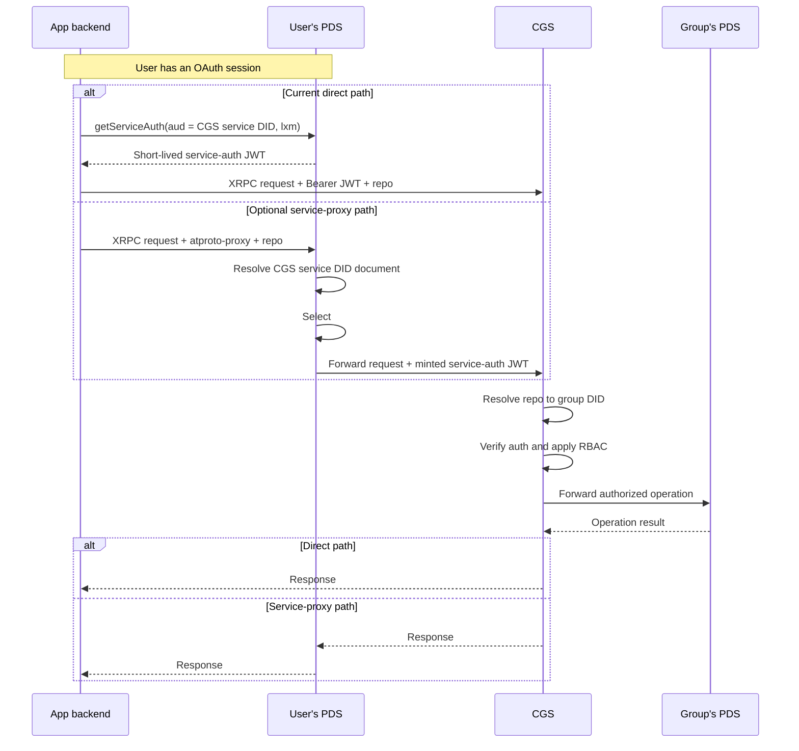

# Certified Group Service (CGS)

In standard AT Protocol, each repository is controlled by a single identity (DID) — there's no built-in way for multiple users to collaboratively manage the same repo with different permission levels.

The [Certified Group Service](https://github.com/hypercerts-org/certified-group-service) (CGS) fills that gap. It's an AT Protocol service that sits between clients and a group's backing PDS, enforcing role-based access control, tracking record authorship, and keeping a full audit log. From the client's perspective, a group looks like any other AT Protocol repository — it just happens to be co-governed.

Certified operates a hosted CGS instance, but CGS is also designed to be **self-hostable per operator** — anyone can run their own instance against any AT Protocol PDS (including, but not limited to, the [Certified-operated PDSs](/reference/certified-pdss)).

A single CGS instance can host groups across multiple PDSs. Each group records its own backing PDS, resolved from the group's DID document and stored per-group. When a group is **imported** ([`app.certified.group.import`](#group-lifecycle)), CGS uses whatever PDS already hosts that account, so imported groups can live on different PDSs within one instance. The `GROUP_PDS_URL` environment variable is narrower than it sounds: it's only the PDS on which `app.certified.group.register` creates **brand-new** group accounts. Letting `register` target a specific PDS per call is not implemented today.

Certified operates production, staging, and test CGS instances. See [Certified Group Services](/reference/certified-group-services) for the current hostnames, version endpoints, and guidance on which to use in which scenario.

## System overview

### How requests reach CGS



The current Certified demo/live path uses the direct branch: the backend obtains a short-lived service-auth JWT from the user's PDS and sends it to `GROUP_SERVICE_URL`. This avoids a PDS DID-document cache race that can temporarily hide the group's service entry after registration.

The optional service-proxy branch uses:

```text
atproto-proxy: did:web:<cgs-host>#certified_group_service
```

The PDS resolves that DID, fetches `https://<cgs-host>/.well-known/did.json`, selects `#certified_group_service`, reads its `serviceEndpoint`, and forwards the request to CGS. This discovery happens inside the user's PDS. CGS then separately resolves `repo` to the target group and applies its RBAC rules.

The older `did:plc:<groupDid>#certified_group` route takes the group from JWT `aud`; it remains only as a deprecated migration path and returns deprecation headers. Imported groups do not receive a group service entry in their DID documents, so they use the direct path unless the account owner adds the required entry separately.

`register` and `import` are service-scoped calls and use direct service-auth requests in the current integration. Group-scoped calls can also use a long-lived, scope-limited API key; API-key requests are always direct and require `repo` in the query string.

## Integrating from an app

For the current integration, your backend should call CGS directly: obtain a service-auth JWT from the user's PDS with `aud` set to the CGS service DID, then send it to the configured CGS URL. Service proxying through the user's PDS is also supported when the relevant DID documents are resolvable, but it is not the current demo/live request path. See the upstream [integration guide](https://github.com/hypercerts-org/certified-group-service/blob/main/docs/integration-guide.md) for a worked example.

CGS uses **custom NSIDs** for writes sent through a PDS proxy — `app.certified.group.repo.createRecord`, `putRecord`, `deleteRecord`, and `uploadBlob` — because the PDS must recognize that the request targets another service. CGS also registers the standard `com.atproto.repo.*` write aliases for direct, non-proxied calls. Standard repo read methods continue to be served by the group's backing PDS.

## Authentication

CGS supports three authentication modes:

- **Service-auth JWTs** — the normal per-request mode. The JWT signature is verified against the issuer's DID document, `lxm` must match the XRPC method, `jti` provides replay prevention, and `exp - iat` cannot exceed the 120-second nonce window.
- **API keys** — long-lived bearer credentials for selected group operations. The key is scoped to a group through the query-string `repo` parameter and is constrained by both its stored scopes and the current role of the member who created it. API keys cannot manage keys or accept an ownership transfer.
- **Operator Basic auth** — `app.certified.group.admin.*` methods use HTTP Basic auth with the configured `CGS_ADMIN_PASSWORD`; these endpoints are disabled when that variable is unset.

For the supported JWT group-targeting form, `aud` is the CGS service DID and `repo` names the group. Query methods and raw-body methods read `repo` from the query string; JSON procedures read it from the body. `register`, `import`, and cross-group membership listing are service-scoped and use the service DID without a group target. The legacy form takes the group from `aud` and omits `repo`; it is accepted only for migration and is marked deprecated.

For a group-scoped request, the handler receives `{ callerDid, groupDid }` after group resolution and proceeds to authorization. Cross-group requests receive just `{ callerDid }`.

## Authorization (RBAC)

Roles are strictly hierarchical and compared numerically. A higher level grants every permission of the lower levels.

```text
member (0)  <  admin (1)  <  owner (2)
```

### Permission matrix

| Operation | Minimum role |
|---|---|
| Create records, upload blobs, list members | member |
| Edit / delete records you authored | member |
| Edit / delete any member's record | admin |
| Edit the group's profile | admin |
| Add / remove members | admin |
| Query the audit log | admin |
| Create, list, or revoke your own API keys | member |
| Propose an ownership transfer | owner |
| Accept an ownership transfer | proposed member, with a DID-authenticated JWT |
| Cancel or view an ownership transfer | member, subject to party checks |
| Change a member's role | owner |
| Destroy the group's CGS registration | owner |

The operator-only `app.certified.group.admin.setOwner` endpoint is outside group RBAC and uses HTTP Basic auth.

### Special rules

- **Cannot modify equal or higher roles.** An admin cannot remove another admin or assign an equal-or-higher role; only an owner can manage roles at that level.
- **The owner role is not assignable through `member.add` or `role.set`.** Normal ownership changes use the two-phase ownership-transfer endpoints. The operator admin endpoint is the break-glass path.
- **Owners cannot be removed or demoted through member APIs.** This takes precedence over self-removal, so an owner cannot remove themselves.
- **Self-removal succeeds for non-owners.** Any member or admin can remove themselves regardless of the equal-or-higher-role rule.
- **Ownership transfer requires acceptance.** The owner proposes an existing member; the proposed member must accept with a DID-authenticated request. Proposals expire after seven days and are visible only to the transfer parties.
- **Authorship is tracked per record.** CGS maintains a `group_record_authors` table so `deleteOwnRecord` can be distinguished from `deleteAnyRecord`.

## PDS proxying and credentials

Once a request is authorized, CGS forwards it to the group's backing PDS using stored credentials:

- **Credential storage.** The group's PDS app password (and, where applicable, the recovery keypair used for PLC operations) is stored encrypted with AES-256-GCM, using a 32-byte master key from the service's `ENCRYPTION_KEY` environment variable.
- **Agent pool.** An authenticated `AtpAgent` per group is cached in memory; stale sessions are refreshed automatically on `AuthenticationRequired` / `ExpiredToken` errors.
- **Blob uploads.** `uploadBlob` requests are limited by `MAX_BLOB_SIZE` (5 MB by default), buffered in CGS, and then forwarded to the group's PDS. API-key uploads additionally require a matching `blob:<mime>` scope.

## Audit logging

CGS records successful mutating operations and authorization decisions in the per-group `group_audit_log` table. Authentication failures and every read request are not necessarily audit rows. Entries can capture:

- **Who** — the caller's DID, or `admin` for operator actions
- **What** — the operation name (for example, `createRecord`, `member.add`, or `ownershipTransfer.accept`)
- **Where** — collection and rkey, for record-level operations
- **Result** — `permitted` or `denied`, with a reason for recorded denials
- **Details** — operation-specific fields, including the API-key reference when a key was used
- **When** — ISO timestamp

The database schema has a `jti` column, but current handlers do not populate or return it. Admins can query the available audit entries via `app.certified.group.audit.query`.

## Cross-group membership

Most CGS operations are scoped to a single group. One endpoint is service-level rather than group-level: `app.certified.groups.membership.list` lets the authenticated user list **every group they belong to on this group service**, along with their role and join date in each. Because it spans groups, its service auth JWT is addressed to the service's own DID (`aud` = service DID) rather than to any one group.

CGS answers this query from a `member_index` table in the global database — a reverse index from member DID to the groups they're in — since the per-group databases have no way to look up membership across groups.

## Group lifecycle

A group enters the service in one of two ways: **register** (create a brand-new account) or **import** (adopt an account that already exists).

**Register** — `app.certified.group.register` requires a service-auth JWT proving the caller controls the prospective owner DID. During registration, CGS:

1. Creates a new PDS account on the instance's configured backing PDS (`GROUP_PDS_URL`) and receives a new group DID.
2. Generates a recovery keypair and registers a `#certified_group` service entry in the group's DID document via a PLC operation.
3. Creates an app password for CGS and stores the encrypted app password and recovery key in its own database.
4. Seeds the caller as the group's first owner.

The generated primary account password is not returned by the current implementation. A supplied recovery email can support the PDS's recovery flow, but the CGS owner role is not proof of control of the underlying account.

**Import** — `app.certified.group.import` adopts a pre-existing PDS account instead of creating one. The caller supplies an app password, and the JWT must be signed by the account being imported (proving control of the group DID beyond merely holding its app password). CGS resolves the account's PDS and handle from **that account's DID document** — which may point to any HTTPS PDS, not just `GROUP_PDS_URL` — authenticates there with the app password, stores the credentials, and seeds the named owner.

Import does not modify the imported account's DID document. CGS does not hold that account's rotation keys, and an app password cannot authorize the PLC operation needed to add a `#certified_group` service entry. Imported groups therefore use direct CGS calls unless the account owner adds the service entry separately with account-level credentials. CGS's own service DID document is separate: it is served by CGS at `/.well-known/did.json` and is not changed by `import`.

Both `register` and `import` are service-level operations (`aud` = the CGS service DID), because the group does not yet exist in CGS when they run. Afterward, the group's DID is co-governed through CGS: owners promote admins, admins manage members, and members interact with the repository subject to the permission matrix above.

**Destroy** — `app.certified.group.destroy` removes the group's registration, credentials, membership index, per-group database, authorship records, and audit log from CGS. It does not delete the underlying PDS account, records, blobs, DID document entry, or PDS app password. Destroy is therefore lossy and irreversible from CGS's perspective; the account can be imported again later, but its CGS history and authorship data are gone. Export the audit log first if it must be retained.

## Storage

CGS uses SQLite for all persistence:

- A **global database** holds the group registry (`groups` table), the nonce cache, and a `member_index` table (the reverse member-to-group index that backs cross-group membership listing). Registered groups also have an encrypted recovery key; imported groups do not.
- Each group gets its **own per-group database**, named by the SHA-256 hash of the group DID. This isolates members, API keys, pending ownership transfers, record authorship, and audit logs per group.
- All databases use WAL mode for concurrent read performance.

## Future directions

The current RBAC model — three fixed roles (`member`, `admin`, `owner`) with a hard-coded permission matrix — is intentionally simple. It covers the common case of a small group co-managing a repository, but it is a starting point rather than an endpoint. Directions being explored as groups' governance needs mature:

- **Customizable roles.** Let each group define its own roles and permissions instead of relying on a fixed three-tier hierarchy.
- **Finer-grained permissions.** Scope permissions per collection or record type — for example, a role that can only create records in one lexicon, or only edit the group profile.
- **Broader governance.** Extend the existing ownership-transfer handshake toward proposals, voting, or quorum-based decisions for other sensitive operations.
- **Time-bound and delegated roles.** Temporary elevations — e.g. an admin grants another member `admin` for 24 hours, after which the role automatically reverts.
- **Credential-based membership.** Derive membership and roles from external signals (verifiable credentials, badges, tokens) rather than only manual `member.add` calls.
- **Per-call PDS targeting for `register`.** A single instance can already host groups across multiple PDSs via `import` (which adopts an account on whatever PDS already hosts it). What's missing is letting `register` create new group accounts on a caller-chosen PDS rather than only the instance's configured `GROUP_PDS_URL`.

None of the above are committed features; they're possibilities being shaped by user and developer needs and feedback.

## Further reading

- [Certified Group Services](/reference/certified-group-services) — hosted CGS instances, environments, and version endpoints
- [CGS repository](https://github.com/hypercerts-org/certified-group-service)
- [Architecture doc](https://github.com/hypercerts-org/certified-group-service/blob/main/docs/architecture.md) — full data model, startup sequence, and implementation details
- [Integration guide](https://github.com/hypercerts-org/certified-group-service/blob/main/docs/integration-guide.md)
- [API reference](https://github.com/hypercerts-org/certified-group-service/blob/main/docs/api-reference.md)
- [Deployment guide](https://github.com/hypercerts-org/certified-group-service/blob/main/docs/deployment.md) — for running your own CGS instance
