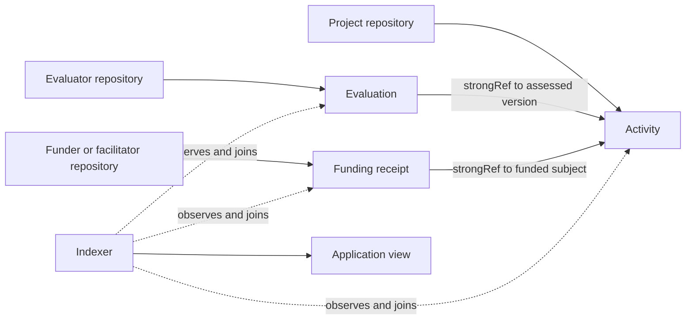

# Records, References & Lifecycle

Hypercerts records do not follow one mandatory sequence. An activity may be published before, during, or after work. Context can appear later from other repositories. Records may also be updated or deleted. The durable model is therefore based on record identity, version identity, and explicit references rather than a fixed workflow.

## Record slots and versions

An AT-URI identifies a record slot:

```text
at://did:plc:alice/org.hypercerts.claim.activity/3k7
```

The three meaningful parts are the publishing repository DID, the Lexicon collection, and the record key. The record stored at that slot can change or disappear.

A CID is the content identifier for one exact version. Updating a record changes its CID while retaining the AT-URI. Deleting a source record removes it from its repository, although relays, indexers, caches, or prior recipients may retain copies.

## Relationship forms

### Strong references

A strong reference pairs the AT-URI with a CID:

```json
{
  "uri": "at://did:plc:alice/org.hypercerts.claim.activity/3k7",
  "cid": "bafyreib2rxk3rh6kzwq7..."
}
```

This records which version the publisher referred to. If the record at that URI is later updated, a consumer can detect that the current CID differs.

A strong reference does not freeze the target, ensure it remains available, prove its contents, or enforce the target Lexicon named in a field description. Consumers must apply those checks.

### URI-only record subjects

Some relationships should survive updates. `app.certified.defs#recordSubject`, used by entity follows, stores an AT-URI without a CID. It follows the record slot rather than one version.

### DIDs and embedded values

A DID identifies an AT Protocol account rather than one record. Embedded objects and strings carry information inside the source record and have no separately addressable lifecycle.

## Forward references and backlinks

Relationships are stored only in the source record. For example:

- An activity points to reusable contributor, contribution, rights, location, and work-scope records.
- A collection points to its activity, feature, or nested-collection items.
- An attachment or measurement points to zero or more subjects.
- An evaluation points to at most one primary subject and may point to supporting measurements.
- A receipt may point to the work or organization it funded.

AT Protocol repository reads can retrieve a known source record. They do not natively answer "which records across the network point to this activity?" That reverse query requires an indexer or another backlink service.



The completeness of an assembled hypercert depends on what the indexer observed, retained, and chose to expose.

## Common lifecycle events

### Create

A client writes a record to a repository. The PDS accepts it into the repository and the repository's signed commit history attributes publication to that DID. Hypercerts Lexicon validation is normally a client, SDK, or indexing responsibility; do not assume every PDS enforces domain schemas.

### Update

The publisher replaces the contents at the same AT-URI. New readers see the new CID. Existing strong references continue to identify the earlier version they cited, provided that version remains available from a source or cache.

### Add context

Another publisher creates a separate record that points to an existing subject. No update to the subject is required. This is how evaluations, measurements, attachments, acknowledgements, badges, and receipts can accumulate across repositories.

### Delete

The publisher deletes the record from its repository. References to it become unresolved against the current source. Consumers should preserve the reference and its CID, mark the target unavailable, and avoid silently substituting another version.

### Discover and aggregate

Relays and indexers can observe records from many repositories and build reverse-reference indexes, search, hydrated views, totals, and rankings. These are derived services with explicit coverage and policy, not canonical fields in the source graph.

## Consumer rules

A compatible consumer should:

1. Preserve source AT-URIs and version CIDs.
2. Distinguish the current record from the version a strong reference cited.
3. Show stale, missing, or deleted targets rather than silently repairing them.
4. Validate that a referenced record has the expected collection and semantics.
5. Identify the indexer and coverage assumptions behind backlinks and aggregates.
6. Keep derived values separate from source records.

Next: [Public Data, Discovery & Portability](/architecture/portability-and-scaling).
