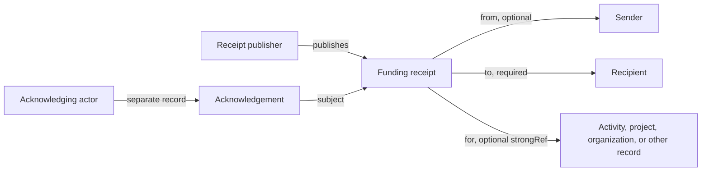

# Funding & Value Flow

Hypercerts can describe funding without prescribing a payment rail or funding mechanism. The released `org.hypercerts.funding.receipt` schema records an assertion about a funding payment. It does not execute or independently verify that payment.

## Hypercerts work with any funding mechanism

Funding can be prospective, concurrent, or retroactive. A receipt can be used around grants, crowdfunding, matching, bounties, purchases, or other mechanisms when the parties can represent the event with the released fields.

The protocol records funding context. It does not define eligibility, allocation, matching, settlement, refunds, or ownership semantics for those mechanisms.

## Tracking funding

The receipt has four required fields:

- `to`: the recipient, represented by free text, a DID, or a strong reference.
- `amount`: a string representing the amount.
- `currency`: a string identifying the payment currency.
- `createdAt`: the record creation time.

It can also include:

- `from`: an optional sender. Omitting it allows an anonymous sender assertion.
- `for`: a strong reference to the activity, project collection, organization record, or other subject funded.
- Payment-rail, date, transaction, memo, and optional signature information.

The schema intentionally supports publishers other than the sender or recipient. A funding platform, grant program, payment processor, sender, or recipient can publish a receipt. Consumers should therefore distinguish the repository publisher from the parties named inside it.

## Connecting funding to work

An acknowledgement can add an independently published acceptance or rejection. It is a relationship record, not a cryptographic counter-signature and not proof of bank or blockchain settlement.

## What applications must decide

The released schema does not guarantee:

- That a payment settled, was not refunded, or matches an external transaction.
- That the publisher was authorized to speak for a named party.
- That every relevant receipt has been published or indexed.
- That duplicate or conflicting receipts have been removed.
- That amount and currency strings can be safely summed without normalization.

Applications should preserve source records, define accepted publishers and payment evidence, identify deduplication rules, and label derived totals as index-dependent.

## Current boundary

The released 1.4.0 Lexicons do not define claim freezing, token wrapping, ownership fractions, auctions, or settlement. Those ideas may appear in historical or future design material, but they are not current protocol behavior and should not be inferred from a funding receipt.

## See also

- [Core Data Model](/core-concepts/hypercerts-core-data-model)
- [Identity, Authorship & Trust](/core-concepts/certified-identity)
- [Records, References & Lifecycle](/architecture/data-flow-and-lifecycle)
- [Funding Receipt reference](/lexicons/hypercerts-lexicons/funding-receipt)
