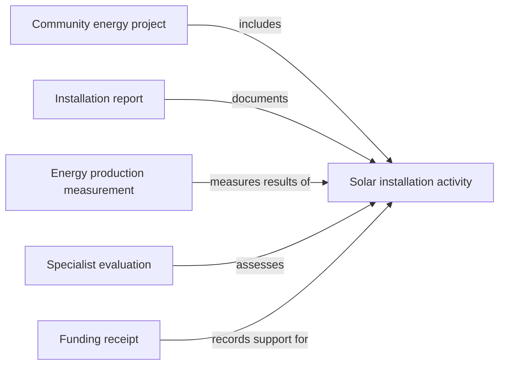

# A Shared Language

“We restored a wetland” and “we reviewed that restoration” are different contributions to the same story. Hypercerts gives each a recognizable form so an application can tell them apart and connect them.

That shared language starts with the work and grows as more people contribute.

## From an activity to a fuller picture

An **activity claim**, also called a hypercert, describes a piece of work. It gives other records something specific to refer to. A project can bring several activities together, while evidence and evaluations help others understand what happened and why it matters.

| Question | Building block |
|---|---|
| What work is being done, and by whom? | An **activity claim**, with contributor details |
| How does it fit into a larger effort? | A **project**, which groups related activities |
| What can we look at or measure? | **Attachments** and **measurements** |
| What do others think of the work? | **Evaluations** |
| Who recognizes or confirms a relationship? | **Badges**, **responses**, and **acknowledgements** |
| What support has the work received? | **Funding receipts** |

Imagine a community energy project. Installing solar panels is one activity. A report describes the installation, a measurement records energy production, and a specialist evaluates the results. A funder can read those pieces together before deciding whether to support the next phase.

These are separate records, not sections everyone edits in a single document. Each can be published by the person or organization contributing that information. Links between them let an application bring the story together.

## Formats and meaning work together

The Lexicons describe the fields software reads and writes. The Guide explains what those records mean and how to use them together.

For example, a project uses a grouping record called a *collection*. Applications agree to recognize a collection marked as a project. That small shared convention lets a project dashboard and a funding platform recognize the same grouping.

You'll also encounter **Certified**. It provides accounts and tools for working with Hypercerts, and its shared schemas describe things such as profiles, organizations, locations, and badges. Those schemas can be used by other applications too.

You don't need to learn every schema before you begin. Start with the records that answer your users' questions. The next pages introduce the main building blocks individually; the [Lexicon inventory](/reference/lexicon-inventory) is there when you want the complete list.

Next: [Activity Claims](/core-concepts/what-is-hypercerts), the starting point for describing the work.
