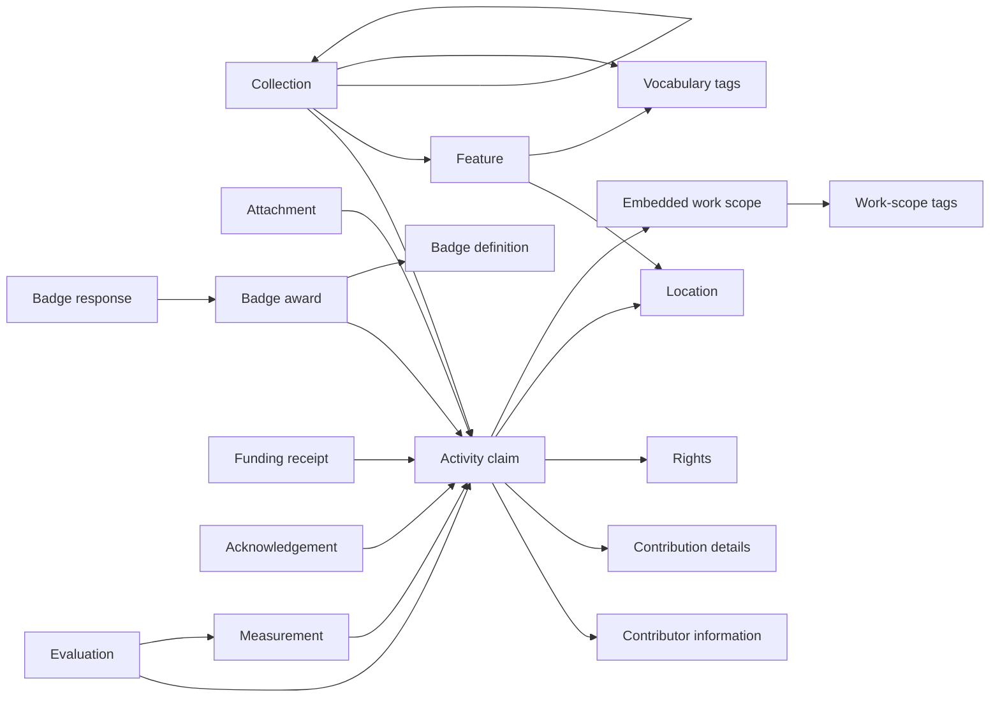

# Core Data Model

The released model is a graph of independently published AT Protocol records. It has no single aggregate object containing a complete project, all evidence, and every assessment. Applications assemble a view from records they can discover and choose to interpret.

This page describes `@hypercerts-org/lexicon` 1.4.0. See the [Lexicon inventory](/reference/lexicon-inventory) for the exact released surface.

## Relationship map

Arrows show the direction stored in the source record. Reverse discovery, such as finding every evaluation of an activity, requires an indexer that has observed those records.

The diagram uses an activity as an example subject. Attachments, measurements, evaluations, funding receipts, acknowledgements, and badge awards can refer to other records where their schemas allow it.

## Activities and contribution detail

`org.hypercerts.claim.activity` describes work. Its required fields are `title`, `shortDescription`, and `createdAt`. Contributors, work scope, dates, locations, rights, and signatures are optional, so "who, what, when, and where" is recommended conceptual coverage rather than the minimum valid shape.

An activity can contain contributor entries. Each entry can keep identity and role information inline or point outward to reusable records:

- `org.hypercerts.claim.contributorInformation` provides identifier and presentation details.
- `org.hypercerts.claim.contribution` provides a role, description, and optional timeframe.
- `org.hypercerts.claim.rights` describes rights or licensing terms and is referenced directly by the activity.

These reusable records do not point back to the activity. The activity contains the relationship.

## Projects, collections, and features

`org.hypercerts.collection` groups activities, `org.hypercerts.entity.feature` records, and nested collections. Each item contains a strong reference and may have a weight.


A project is not a separate Lexicon. The shared convention is an `org.hypercerts.collection` record with `type: "project"`. The `type` field is optional and open, so applications must implement this convention. Project membership is stored from the collection to its items; activities have no project field.


A feature represents a non-agent subject, such as a geographic zone, ecological stratum, participant cohort, or campaign. It can carry locations, general vocabulary tags, and external identifiers. Collections can group features with the activities concerning them.

## Context records

Context records can be published after their subjects and from different repositories:

| Record | Stored relationship | Important limit |
|---|---|---|
| `org.hypercerts.context.attachment` | Optional plural `subjects` | An attachment may be evidence, commentary, a report, or another content type; it does not verify itself. |
| `org.hypercerts.context.measurement` | Optional plural `subjects`; optional measurer DIDs and evidence URIs | The schema does not establish methodology quality or measurer authority. |
| `org.hypercerts.context.evaluation` | Optional singular `subject`; optional measurement references | Named evaluators are not automatically corroborated by the repository publisher. |
| `org.hypercerts.context.acknowledgement` | Required `subject`; optional relationship `context` | Acknowledgement is an independent acceptance or rejection record, not an automatic counter-signature. |

An activity does not have to be changed when new context is published. The graph grows as indexers discover records that point to it.

## Funding records

`org.hypercerts.funding.receipt` describes a claimed funding payment. It requires a recipient, amount, currency, and creation time. The sender and funded subject are optional. Parties may be represented by text, a DID, or a record reference.

A receipt can point to an activity, a project collection, an organization record, or another subject. It does not itself prove settlement or prevent duplicate and conflicting receipts. See [Funding Records & Value Flow](/core-concepts/funding-and-value-flow).

## Two classification systems

The released model deliberately separates:

- `org.hypercerts.workscope.tag`, referenced by the CEL expression embedded in an activity's work scope.
- `org.hypercerts.vocab.tag`, used to classify collections and features.

They have different purposes and hierarchy rules. They should not be treated as one interchangeable tag system. See [Work Scopes & Classification](/core-concepts/cel-work-scopes).

## Adjacent Certified records

The `app.certified.*` namespace supplies records that Hypercerts applications can use around the work graph:

- Actor profiles and organization metadata describe the repository identity. Their relationship comes from sharing the same repository and `self` record key, not an explicit link.
- Location records provide reusable spatial representations.
- Badge definitions, awards, and responses model recognition and recipient response.
- Account follows and entity follows help clients define social and discovery scopes.
- EVM link records connect a DID to an EVM address through a proof structure.
- Signature definitions and proof records support optional record-content attestations.

These records complement Hypercerts but do not create organization membership, project ownership, evaluator independence, or universal trust rules.

## References are typed by usage

The graph uses several relationship forms:

- **Strong reference:** an AT-URI plus CID, used to pin one content version.
- **AT-URI:** identifies a record slot without pinning a version, useful when a relationship should survive updates.
- **DID:** identifies an AT Protocol account.
- **Embedded object or string:** carries information by value rather than linking to another record.

Most strong-reference target restrictions are described conventions rather than constraints enforced by the generic `strongRef` shape. Compatible applications must validate both the reference structure and the expected target semantics.

Next: [Identity, Authorship & Trust](/core-concepts/certified-identity).
