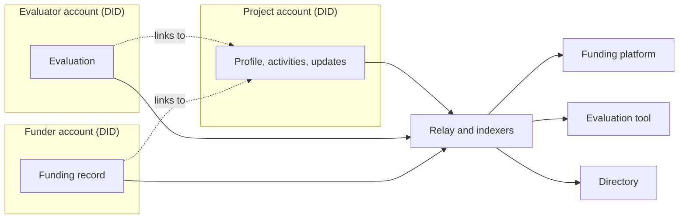

# Why AT Protocol?

Suppose a project publishes a progress update through a funding platform. An evaluator wants to assess that work using their own tool. Another funder wants to read both. They shouldn't need to join the first platform or negotiate a custom data-sharing arrangement just to work with the same public information.

Hypercerts builds on [AT Protocol](https://atproto.com/docs), the open network technology that also powers Bluesky. It gives people an account and a place to publish records that different applications can work with.

## Records belong to accounts, not just apps

Think of a **record** as a small structured document, such as a description of an activity or an evaluation. An account keeps its records in a **repository**, a little like a folder of those documents. A **Personal Data Server (PDS)** hosts that repository. People can use a hosted service; they don't need to run their own server.

An app helps someone create and read these records. The records can also be read by other apps that support their format. This separates the information from the interface used to publish it.

AT Protocol also gives each account a lasting identifier called a **DID**, short for decentralized identifier. It identifies the account separately from its current name or hosting server. This is what allows an account to keep its identity when moving between supported hosts.

## You own your records and can take them with you

On most platforms, the information you create belongs to the platform. A project's profile, updates, and funding history sit in that platform's database, under rules the platform sets and can change. If the project wants to move, it starts again from nothing. If the platform shuts down, the history disappears with it. And when leaving means losing something important, the platform has little reason to serve you well.

AT Protocol works differently. A project's records live in its own repository, under its own identity, and every record is signed so anyone can check who published it. The project controls them:

- **Ownership.** The project decides what to publish, update, or delete. Other people and apps can link to its records or respond to them, but they can't change them.
- **Portability.** The project can move its repository to another host and keep its identity, its records, and the links others have made to them.
- **No lock-in.** Any compatible app can read the same records. A project can apply through a new platform and bring its history with it, and if one app closes, another can still show that history.

Each account keeps its own records. Links connect them, and any app can read across all of them.

It works much like a website: you can change hosting providers without losing your address or your content. For the people using an app, all of this stays in the background.

This is what lets trust travel. The updates, endorsements, and funding records a project builds up in one place stay with the project, so the next funder sees what came before, on whatever platform it uses. For a longer introduction to this idea, see Dan Abramov's [Open Social](https://overreacted.io/open-social/).

## Other people can add their perspective

The evaluator publishes a new record in their own repository and links it to the project's work. The original activity stays with the project. The assessment stays with its publisher.

A funding app can then show them together. This is a central idea in Hypercerts: people can contribute information about the same work without sharing one account or giving each other permission to edit their records.

## A network needs a shared language

AT Protocol provides accounts, publishing, and links between records. Hypercerts provides the formats for describing work, evidence, evaluations, and funding.

These formats are defined in **Lexicons**. A Lexicon is a schema: it tells software what kind of record it is reading and which fields to expect. Using the same formats lets an evaluation tool and a funding platform exchange meaningful information, even if their interfaces look completely different.

To find information spread across accounts, applications use **indexers**. An indexer collects records and makes them searchable, including connections such as “evaluations of this activity.” Each indexer has its own coverage, so different apps may show different parts of the network.

You now have the basic division of work: AT Protocol lets people publish, Hypercerts gives the information a shared meaning, and applications help people use it.

Next, let's look at [the shared language itself](/core-concepts/hypercerts-core-data-model).
