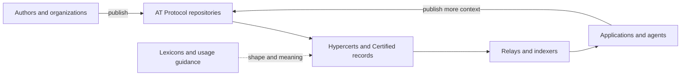

# Guide

Hypercerts gives valuable work, project context, assessments, and funding history shared formats that independent applications can reuse. This Guide explains the protocol model and the conventions that make those records meaningful together.

Use the Guide to understand the system. Use [Client Integration](/client-integration) for tested implementation paths and [Reference](/reference) for exact schemas and service contracts.


The current schema baseline is `@hypercerts-org/lexicon` 1.4.0. Hypercerts evolves through additive Lexicon releases and shared usage guidance. There is no ratified conformance specification or universal compatibility badge.


## What the protocol includes

The practical protocol spans several layers:

| Layer | Responsibility |
|---|---|
| **AT Protocol** | DIDs, repositories, record addressing, signed commits, Personal Data Servers (PDSs), and data portability |
| **Released Lexicons** | The structural shapes for Hypercerts and Certified records |
| **Shared usage guidance** | Conventions for concepts such as projects, references, attribution, classification, and interpretation |
| **Applications and services** | Writing, discovery, indexing, aggregation, policy, and user experience |
| **Change history** | Released additions, corrections, and migration context |

Lexicons establish structural validity. They do not prove that work happened, that an evaluator is independent, that a receipt corresponds to a settled payment, or that an index contains every related record. Those judgments depend on provenance, corroboration, application policy, and evidence.

## Follow the model



Start with the problem, the protocol boundary, and what a hypercert represents.


Understand the identity, record, and portability foundation.


See every released record family, relationship direction, and higher-level convention.


Map real scenarios to the record graph without depending on one application.



## Understand meaning and trust

- [Identity, Authorship & Trust](/core-concepts/certified-identity) separates repository publishers, named actors, attestations, and application trust decisions.
- [Work Scopes & Classification](/core-concepts/cel-work-scopes) distinguishes activity scope expressions from tags used to classify projects and features.
- [Funding Records & Value Flow](/core-concepts/funding-and-value-flow) explains what a receipt records and what it does not prove.

## Operate across repositories

- [Records, References & Lifecycle](/architecture/data-flow-and-lifecycle) explains record slots, versions, strong references, updates, deletion, and backlink discovery.
- [Public Data, Discovery & Portability](/architecture/portability-and-scaling) explains the difference between publication, availability, discovery, and indexed views.
- [Validation, Extension & Interpretation](/core-concepts/validation-and-interpretation) separates schema checks from application semantics and explains safe extension.

For an exact list of released schemas, continue to the [Lexicon inventory](/reference/lexicon-inventory).
