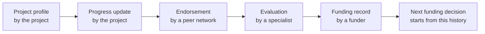

# Guide

Today, projects answer the same questions for every funder, and each funder assesses projects from scratch, even when others already know the work well. Hypercerts makes that knowledge reusable: projects own the records of their work and can take them to any platform, and the people who review them, vouch for them, and back them add trust signals that the next funder can see. This Guide explains how that works.

If you'd like the high-level story first, visit [hypercerts.org](https://hypercerts.org). Here, we'll go one level deeper, from describing a piece of work to connecting it with evidence, independent assessments, and funding.

## Start with what people already know

A project team knows what it has been doing. A community knows how that work affects local people. A specialist can assess the methods. A funder knows why it chose to offer support. Each holds a different part of the picture.

Usually, these pieces end up in separate application forms, reports, and databases. Hypercerts gives them a shared format and a way to connect. A team can publish an update through one app, an evaluator can review the work through another, and a funding platform can bring both into view.

The people contributing information keep their own voices. An evaluator publishes their assessment rather than editing the project's account of its work. Later, someone deciding whether to fund the project can see both accounts and the evidence behind them.

That is how trust builds over time. Each update, endorsement, assessment, or funding record lowers the cost of the next decision, which can begin with what is already known rather than another blank form.

```mermaid
flowchart LR
  P["Project profile<br/>by the project"] --> U["Progress update<br/>by the project"]
  U --> E["Endorsement<br/>by a peer network"]
  E --> V["Evaluation<br/>by a specialist"]
  V --> F["Funding record<br/>by a funder"]
  F --> N["Next funding decision<br/>starts from this history"]
```

This matters more as AI makes polished applications cheap to write. Signals from outside the application, attributed to the people who gave them, help funders and their tools tell a strong project from a strong pitch.

Hypercerts doesn't decide which work is valuable or whose judgment counts. Each funder chooses which signals to trust and how to weigh them.

## What you'll learn

We'll follow three parts of that story:

1. **Make information reusable.** Meet the open network underneath Hypercerts and the shared language that lets different apps understand the same records.
2. **Build a fuller picture of the work.** Describe activities and projects, add evidence and evaluations, recognize contributions, and record funding.
3. **Put that knowledge to use.** Understand how records stay connected as they change, how apps find them, and where your own application can contribute.

Along the way, we'll introduce technical terms such as *Lexicon*, *repository*, and *indexer* when they help explain a practical question. Exact fields and constraints are linked in the Reference for when you need them.

By the end, you should be able to explain how the pieces fit together and choose a starting point for your application. [Client Integration](/client-integration) is the next step toward building it.

Start with [Why AT Protocol?](/core-concepts/why-at-protocol): how can people using different apps contribute to the same picture?
