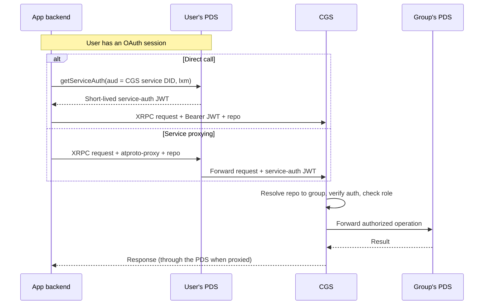

# Certified Group Service

The Certified Group Service (CGS) lets several people manage one AT Protocol repository together, each with their own role. An organization, lab, or project can publish Hypercerts records from a shared account while every member signs in as themselves.

## What it does

In AT Protocol, a repository is the signed collection of records that belongs to one account, identified by a DID (a permanent account identifier). The repository is hosted on a Personal Data Server (PDS), the server that stores an account's records and identity. Normally one identity controls each repository, and there is no built-in way for several people to share it with different permission levels.

CGS adds that. A **group** is an account whose repository is co-governed by several members. Each member has a role (member, admin, or owner) that decides what they can do. CGS checks every write against those roles, keeps track of who authored each record, and writes an audit log. To everyone reading the data, a group looks like any other AT Protocol repository.

Hypercerts records live in many PDSs, including the [Certified PDSs](/reference/services/certified-pdss) the Foundation hosts. The [entryway](/reference/services/entryway) handles sign-in and account hosting for individual Certified accounts; CGS sits in front of a group's PDS for shared accounts. Records a group publishes are collected like any others: a relay and Jetstream pass changes to the [indexer](/reference/services/indexer), which serves the Hypercerts API. [Labelers](/reference/services/labelers) and the [feed service](/reference/services/feed-service) work on group records the same way.

CGS is optional. Use it when you want co-governed repositories. The "create a group" flow on [certified.app](https://certified.app) uses a Foundation-hosted CGS.

## How it works

CGS sits between your application and the group's PDS. Each request goes through these steps:

1. CGS authenticates the caller and works out which group the request targets.
2. It checks the caller's role in that group against the permission matrix.
3. If the request uses an API key, it also checks the key's scopes.
4. It forwards authorized writes and blob uploads to the group's PDS, using credentials it stores encrypted for that group.
5. It records the operation, or the denial, in the group's audit log.

Reads do not go through CGS. Standard repository reads are served by the group's PDS, like for any account.

### How requests reach CGS

CGS is identified by a service DID of the form `did:web:<cgs-host>`. It publishes its DID document at `https://<cgs-host>/.well-known/did.json`, which lists the `#certified_group_service` endpoint. There are two ways to send a request.

**Direct call (current integration).** Your backend asks the user's PDS for a short-lived service-auth token addressed to CGS, then calls CGS itself. A service-auth token is a JWT signed with the user's key that proves to another service who is calling and which method they are allowed to call.

**Service proxying (optional).** AT Protocol service proxying lets an app send a request to the user's own PDS with an `atproto-proxy` header naming another service. The PDS looks up that service's DID document, finds the endpoint, and forwards the request with a service-auth token it creates. CGS then resolves the target group from the request and applies its rules.



The Foundation's own applications use direct calls. Direct calls avoid a timing problem where a PDS has cached an older DID document and cannot yet see a newly registered group's service entry.

### Authentication

CGS accepts three kinds of credentials:

- **Service-auth JWTs.** The normal per-request mode. CGS verifies the signature against the caller's DID document. The token's `lxm` claim must match the method being called, each token can be used only once, and a token can be valid for at most 120 seconds.
- **API keys.** Long-lived keys for backend access to one group, sent in the `X-API-Key` header with the group in the `repo` query parameter. A key is limited by its scopes and by the current role of the member who created it. API keys cannot manage keys or accept an ownership transfer.
- **Operator credentials.** A small set of `app.certified.group.admin.*` methods for the people running a CGS instance. They use HTTP Basic auth and are outside group roles.

For group requests, the token's audience (`aud`) is the CGS service DID and the `repo` parameter names the group, as a DID or handle. Query methods and methods with a raw body (such as blob uploads) read `repo` from the query string; JSON procedures read it from the body. A few methods are not tied to one group and use the service DID without a `repo`: `register`, `import`, and listing your memberships across groups.

An older form that puts the group DID in `aud` and omits `repo` still works during migration, but it is deprecated and responses carry deprecation headers.

### Roles and permissions

There are three roles, strictly ordered. A higher role has every permission of the lower ones.

```text
member (0)  <  admin (1)  <  owner (2)
```

| Operation | Minimum role |
|---|---|
| Create records, upload blobs, list members | member |
| Edit or delete records you authored | member |
| Edit or delete any member's record | admin |
| Edit the group's profile | admin |
| Add or remove members | admin |
| Query the audit log | admin |
| Create, list, or revoke your own API keys | member |
| Propose an ownership transfer | owner |
| Accept an ownership transfer | the proposed member, with a service-auth JWT |
| Cancel or view an ownership transfer | member, if a party to the transfer |
| Change a member's role | owner |
| Destroy the group's CGS registration | owner |

Additional rules:

- **No acting on equal or higher roles.** An admin cannot remove another admin or give anyone an admin or owner role.
- **The owner role is not assigned through normal member calls.** Ownership changes go through the two-step ownership transfer.
- **Owners cannot be removed or demoted through member calls,** including by themselves.
- **Non-owners can always remove themselves.**
- **Ownership transfer needs acceptance.** The owner proposes an existing member, and that member accepts with their own signed request. Proposals expire after seven days and are visible only to the two parties.
- **Authorship is tracked per record,** which is how CGS tells "delete your own record" apart from "delete any record".

## Using it from your application

### Writing to a group

The recommended path is a direct call from your backend:

1. With the user's OAuth session, call `com.atproto.server.getServiceAuth` on the user's PDS with `aud` set to the CGS service DID (for example `did:web:groups.certified.app`) and `lxm` set to the method you will call.
2. Send the request to the CGS host with the token as `Authorization: Bearer <jwt>` and the group in `repo`.

For direct calls, CGS accepts the standard `com.atproto.repo.createRecord`, `putRecord`, `deleteRecord`, and `uploadBlob` methods. Blob uploads are limited to 5 MB by default.

To use service proxying instead, send the request to the user's PDS with:

```text
atproto-proxy: did:web:<cgs-host>#certified_group_service
```

and include `repo` with the group DID or handle. Writes sent through a PDS proxy use CGS's own method names: `app.certified.group.repo.createRecord`, `putRecord`, `deleteRecord`, and `uploadBlob`. The PDS needs these separate names to recognize that the request is for another service.

The older proxy target `did:plc:<groupDid>#certified_group` is deprecated and kept only for migration. Imported groups never have that entry in their DID documents, so use direct calls for them.

The upstream [integration guide](https://github.com/hypercerts-org/certified-group-service/blob/main/docs/integration-guide.md) has a worked example, and the [API reference](https://github.com/hypercerts-org/certified-group-service/blob/main/docs/api-reference.md) documents every method.

### Listing a user's groups

`app.certified.groups.membership.list` returns every group the authenticated user belongs to on that CGS instance, with their role and join date in each. Because it spans groups, the token's `aud` is the CGS service DID and there is no `repo`.

### Group lifecycle

A group enters CGS in one of two ways.

**Register.** `app.certified.group.register` creates a new account for the group. The caller signs the request as the intended owner. CGS creates the account on the PDS that instance is configured to use, adds a `#certified_group` service entry to the group's DID document, stores an app password for the account, and makes the caller the first owner. On Foundation-hosted CGS, each environment creates groups on the matching Certified PDS environment. CGS does not return the account's primary password. Holding the owner role in CGS is not the same as controlling the underlying account.

**Import.** `app.certified.group.import` brings in an account that already exists. The caller provides an app password for the account, and the request is signed by the account being imported, which proves control of it. CGS finds the account's PDS from its DID document, so an imported group can live on any PDS, not only the one the instance creates groups on. Import does not change the account's DID document, which is why imported groups use direct calls.

**Destroy.** `app.certified.group.destroy` removes the group from CGS: its registration, stored credentials, membership, authorship records, and audit log. It does not delete the account, its records, its blobs, or its app password on the PDS. This cannot be undone on the CGS side. The account can be imported again later, but its CGS history is gone, so export the audit log first if you need it.

### Audit log

CGS writes an audit entry for each successful change and for each authorization decision, including denials. Entries record who acted (a DID, or `admin` for operator actions), the operation, the collection and record key for record operations, whether it was permitted or denied and why, operation details such as which API key was used, and a timestamp. Admins can read the log with `app.certified.group.audit.query`. Failed authentication and ordinary reads are not necessarily logged.

## Status

CGS is released and versioned. See the [CGS changelog](/changes/cgs) for release history.

To check the version a running instance reports, call `/health` or `/xrpc/_health`. Both return the CGS version:

```json
{"status":"ok","service":"group-service","version":"<semver>+<commit>"}
```

CGS is not a PDS, so unlike on a PDS, `/xrpc/_health` reports the CGS version and not the version of the group's PDS. To check that PDS, call its own `/xrpc/_health`.

The Foundation hosts production, staging, and test instances. Use production for live apps and staging for your own staging environment; staging changes are announced ahead of time but it is not guaranteed to be as stable as production. The test instance runs the newest code for Hypercerts core development, and data there can be wiped without notice. For hostnames, see [Running services](/reference/services#running-services). Operational status is published on [certified.instatus.com](https://certified.instatus.com/) (production and staging) and [test-certified.instatus.com](https://test-certified.instatus.com/) (test).

## Running your own

Operating your own CGS instance is outside the scope of this documentation for now. Anyone can run one against any AT Protocol PDS; see the [CGS repository](https://github.com/hypercerts-org/certified-group-service) and its [deployment guide](https://github.com/hypercerts-org/certified-group-service/blob/main/docs/deployment.md). Each instance is configured with the PDS where it creates new group accounts.

## Related

- [Services overview](/reference/services) and [Running services](/reference/services#running-services)
- [Certified PDSs](/reference/services/certified-pdss)
- [Entryway](/reference/services/entryway)
- [Account & Identity Setup](/architecture/account-and-identity)
- [Certified lexicons](/lexicons/certified-lexicons)
- [CGS changelog](/changes/cgs)
